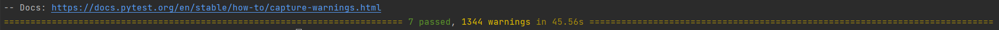

# cs5293sp22-project1
Name: Sai Prakash Davuluri

Goal: The aim of the project is to use the knowledge of Python and Text Analytics to develop a system that accepts plain text documents then detect and redact 
"sensitive items".

## How to run the application
### steps:
1) First clone the project using : git clone <project-url>
2) check to see if there is a directory named as 'cs5293sp22-project1' using ls
3) open the directory using cd cs5293sp22-project1
4) Run the below command to start the project:

`pipenv run python redactor.py --input '*.txt' --input '*/*.txt' --names --dates --phones --genders --address --concept 'kids' --concept 'prison' --output 'files/' --stats stderr`

#### WEB OR EXTERNAL LIBRARIES:
1) en_core_web_lg
2) argparse
3) nlp
4) spacy
5) nltk
6) pytest
7) pyap

#### INSTALLATION OF ABOVE LIBRARIES:
1) en_core_web_lg is a large english pipeline trained on written web text. This is automatically installed through Pipfile or you can use this command to install it: pipenv run python -m spacy download en_core_web_lg
2) pipenv install argparse
3) pipenv install nlp
4) pipenv install spacy
5) pipenv install nltk
6) pipenv install pytest
7) pipenv install pyap

### Assumptions made in the project
The following assumptions were made after analyzing the selected files from the provided dataset.

Definition of names: I am defining name as people's name. It might be first name or last name or middle name.
* In redactNames() method, my assumption is that spacy and nltk libraries identifies all the names in the file. But there are few edge cases where it fails to identify, few formats are mentioned below.
  Edge cases for names:
    1) /name or 
    2) name;
    3) name-Initial
    4) name \n name;

Definition of dates: My definition of dates comes from my analysis of files from the dataset. I am considering yesterday, today, monday, tuesday, wednesday etc. also as dates. 
* In redactDates() method, I have analysed and identified the date formats used and wrote regular expressions to detect and collect those dates whenever a file comes for redaction. As there are millions of date formats, I have assumed that spacy library can detect and collect date formats which were not covered by written regular expressions.
Definition of phones: My definition of phone numbers comes from my analysis of files from the dataset. 
* In redactPhones() method, I have done the same as redactDates() method. At first, I have identified various formats of phone numbers used in the dataset and wrote regular expressions that detect and collects these values from the file. I have also wrote regular expressions for similar formats.
Definition of address: My definition of address is a string which contains value from street name to zipcode like 2236 Houston Avenue, Norman, OK 73071 but not Geopolitical entity like Austin, Oklahoma, etc.
* In redactAddress() method, I am assuming that pyap library detects every address in the file and returns values as output.
Definition of genders: I have defined a static list which holds all possible words that reveal the identity of a person.
* In redactGenders() method, based on the values in the pre-defined list I am redacting the content in the file.
* One important thing to note here, The format of the output file might differ from original file in some cases.


### Functions and approach
redactor(args) function in redactor.py:
* This method takes args as input which was passed from the command line and goes through every flag if true and calls appropriate method in main.py to detect and collect sensitive information.
* For input flag, it first collects all the extensions which was passed by user and uses nltk.flatten() method to flatten the list. If no input flag is passed then error message is displayed.
* First, I am looping through the provided extensions and used glob library to collect all relevant files and stored them in a list to iterate them in the future.
* Using for loop, I am iterating every file in the list and based on the flags passed from command line, related methods will be called to detect and collect sensitive information.
  
  _Example:_ _if args.names is true then redactObj.redactNames(fileName, redactContents) method will be called._
* I am initializing a dictionary called redactContents and passing it to every method to collect the sensitive information as list and storing it in the dictionary.
  
  _Example: redactContents['names'] = namesHoldingList_
* Multiple flags can be given for concept. So, I am using a for loop to iterate through the list and collecting the sentences in a list. Finally, storing it in the redactContents dictionary. I am using nltk.flatten() method to flatten the list before storing it in the dictionary.
* After detecting and collecting the sensitive information in the dictionary, along with args and fileName passing it to the redactContent method in main.py as parameters for redaction.
  
##### Three output cases:
    
  case 1:
   * The redacted content is stored in content variable. The glob library picks up the filename along with directory name. So, to get the appropriate file name I am using a for loop to read the string from backwards and breaking loop when it encounters characters like '/' or '\\'.
     
     _Example path picked by glob library: inputFiles/sample4.txt_
   * Before writing the redacted content to the file, I am first checking if the file path exists or not. If not then I am creating the directory with os.mkdir(args.output) and creating a file with open(args.output + fileName + '.redacted', mode="w", encoding='utf-8') method with the mentioned parameters.
   * If file already exits in the specified path then I am opening the file and writing the redacted content to it.
   
  case 2:
   * When stdout is passed, I am using sys library to write the output to console/command line.
      
    _Example: sys.stdout.write(content)_
  
  case 3:
   * When stderr is passed, I am using sys library to write the output to console/command line.
      
    _Example: sys.stderr.write(content)_
  
##### Three cases for stats file:
    
  * case 1: When passed input is not stdout or stderr, the program will check to see if there exists a path with the passed input parameter. If not it will create the directory with that input parameter and a file named stats.txt in that directory.

  * case 2: when stdout is passed, I am using sys library to write the stats to console/command line.

  * case 3: When stderr is passed, I am using sys library to write the stats to console/command line.


redactNames(self, fileName, redactContents):
* This method takes fileName and redactContents as parameters, the fileName provides the name of the current file and redactContents stores the list of names which were detected and collected to hide sensitive information.
* I have surrounded open() method with try-catch block, to catch any unexpected errors.
* Using nltk.sent_tokenize() method, I am dividing the content to individual sentences and holding them in a list. After that, I have loaded 'en_core_web_lg' english pipeline using spacy.load() method and stored it in the nlp variable.
* Now, I am iterating the stored sentences and passing every sentence to nlp() method and iterating ents in the sentence to check if there is any PERSON label. If so, I am storing the text in a list called namesHoldingList. 
* Again, I am using nltk.tokenize.word_tokenize() method to break down the corpus to words and using nltk.pos_tag() to tag the given list of tokens. Finally, using nltk.ne_chunk() to chunk the given list of tagged tokens.
* Using for loop, I am iterating through the list and if type(entities) == Tree and label for that entity is PERSON then I am storing it in the namesHoldingList.
* At the end of the method, I am storing the final list of contents in the dictionary called redactContents and returning it to the redactor() method in redactory.py file.

redactDates(self, fileName, redactContents):
* This method takes fileName and redactContents as parameters, the fileName provides the name of the current file and redactContents stores the list of dates which were detected and collected to hide sensitive information.
* I have surrounded open() method with try-catch block, to catch any unexpected errors.
* I have used following regular expressions to identify dates in the file:
  

  Format 1: Wed, 9 Jan 2002
  
     Regular expressions: below regular expressions also contains formats related to format 1.

```
     "([mM]onday?|[tT]uesday?|[wW]ednesday?|[tT]hrusday?|[fF]riday?|[sS]aturday?|[sS]unday?)(,)\s([\d]{1,2})\s([jJ]anuary?|[fF]ebruary?|[mM]arch?|[aA]pril?|[mM]ay?|[jJ]une?|[jJ]uly?|[aA]ugust?|[sS]eptember?|[oO]ctober?|[nN]ovember?|[dD]ecember?)\s([\d]{4})"
     
     "([mM]onday?|[tT]uesday?|[wW]ednesday?|[tT]hrusday?|[fF]riday?|[sS]aturday?|[sS]unday?)(,)\s([\d]{1,2})\s([jJ]an?|[fF]eb?|[mM]ar?|[aA]pr?|[mM]ay?|[jJ]un?|[jJ]ul?|[aA]ug?|[sS]ep?|[oO]ct?|[nN]ov?|[dD]ec?)\s([\d]{4})"
     
     "([mM]on?|[tT]ues?|[wW]ed?|[tT]hrus?|[fF]ri?|[sS]at?|[sS]un?)(,)\s([\d]{1,2})\s([jJ]anuary?|[fF]ebruary?|[mM]arch?|[aA]pril?|[mM]ay?|[jJ]une?|[jJ]uly?|[aA]ugust?|[sS]eptember?|[oO]ctober?|[nN]ovember?|[dD]ecember?)\s([\d]{4})"

     "([mM]on?|[tT]ues?|[wW]ed?|[tT]hrus?|[fF]ri?|[sS]at?|[sS]un?)(,)\s([\d]{1,2})\s([jJ]an?|[fF]eb?|[mM]ar?|[aA]pr?|[mM]ay?|[jJ]un?|[jJ]ul?|[aA]ug?|[sS]ep?|[oO]ct?|[nN]ov?|[dD]ec?)\s([\d]{4})"
  ```

  Format 2: Friday, November 02, 2001
     Regular expressions: below regular expressions also contains formats related to format 2.


     "([mM]onday?|[tT]uesday?|[wW]ednesday?|[tT]hrusday?|[fF]riday?|[sS]aturday?|[sS]unday?)(,)\s([jJ]anuary?|[fF]ebruary?|[mM]arch?|[aA]pril?|[mM]ay?|[jJ]une?|[jJ]uly?|[aA]ugust?|[sS]eptember?|[oO]ctober?|[nN]ovember?|[dD]ecember?)\s([\d]{1,2})(,)\s([\d]{4})"
     
     "([mM]onday?|[tT]uesday?|[wW]ednesday?|[tT]hrusday?|[fF]riday?|[sS]aturday?|[sS]unday?)(,)\s([jJ]an?|[fF]eb?|[mM]ar?|[aA]pr?|[mM]ay?|[jJ]un?|[jJ]ul?|[aA]ug?|[sS]ep?|[oO]ct?|[nN]ov?|[dD]ec?)\s([\d]{1,2})(,)\s([\d]{4})"
     
     "([mM]on?|[tT]ues?|[wW]ed?|[tT]hrus?|[fF]ri?|[sS]at?|[sS]un?)(,)\s([jJ]anuary?|[fF]ebruary?|[mM]arch?|[aA]pril?|[mM]ay?|[jJ]une?|[jJ]uly?|[aA]ugust?|[sS]eptember?|[oO]ctober?|[nN]ovember?|[dD]ecember?)\s([\d]{1,2})(,)\s([\d]{4})"
     
     "([mM]on?|[tT]ues?|[wW]ed?|[tT]hrus?|[fF]ri?|[sS]at?|[sS]un?)(,)\s([jJ]an?|[fF]eb?|[mM]ar?|[aA]pr?|[mM]ay?|[jJ]un?|[jJ]ul?|[aA]ug?|[sS]ep?|[oO]ct?|[nN]ov?|[dD]ec?)\s([\d]{1,2})(,)\s([\d]{4})"


  Format 3: Friday 11/9/01
     Regular expressions: below regular expressions also contains formats related to format 3.

     "([mM]onday?|[tT]uesday?|[wW]ednesday?|[tT]hrusday?|[fF]riday?|[sS]aturday?|[sS]unday?)\s([\d]{1,2}/[\d]{1,2}/[\d]{4})"
     
     "([mM]onday?|[tT]uesday?|[wW]ednesday?|[tT]hrusday?|[fF]riday?|[sS]aturday?|[sS]unday?)\s([\d]{4}/[\d]{1,2}/[\d]{1,2})"
     
     "([mM]onday?|[tT]uesday?|[wW]ednesday?|[tT]hrusday?|[fF]riday?|[sS]aturday?|[sS]unday?)\s([\d]{1,2}-[\d]{1,2}-[\d]{4})"
     
     "([mM]onday?|[tT]uesday?|[wW]ednesday?|[tT]hrusday?|[fF]riday?|[sS]aturday?|[sS]unday?)\s([\d]{4}-[\d]{1,2}-[\d]{1,2})"
     
     "([mM]onday?|[tT]uesday?|[wW]ednesday?|[tT]hrusday?|[fF]riday?|[sS]aturday?|[sS]unday?)\s([\d]{1,2}/[\d]{1,2}/[\d]{2})"
     
     "([mM]onday?|[tT]uesday?|[wW]ednesday?|[tT]hrusday?|[fF]riday?|[sS]aturday?|[sS]unday?)\s([\d]{2}/[\d]{1,2}/[\d]{1,2})"
     
     "([mM]onday?|[tT]uesday?|[wW]ednesday?|[tT]hrusday?|[fF]riday?|[sS]aturday?|[sS]unday?)\s([\d]{1,2}-[\d]{1,2}-[\d]{2})"
     
     "([mM]onday?|[tT]uesday?|[wW]ednesday?|[tT]hrusday?|[fF]riday?|[sS]aturday?|[sS]unday?)\s([\d]{2}-[\d]{1,2}-[\d]{1,2})"
     
     "([mM]on?|[tT]ues?|[wW]ed?|[tT]hrus?|[fF]ri?|[sS]at?|[sS]un?)\s([\d]{1,2}/[\d]{1,2}/[\d]{4})"
     
     "([mM]on?|[tT]ues?|[wW]ed?|[tT]hrus?|[fF]ri?|[sS]at?|[sS]un?)\s([\d]{4}/[\d]{1,2}/[\d]{1,2})"
     
     "([mM]on?|[tT]ues?|[wW]ed?|[tT]hrus?|[fF]ri?|[sS]at?|[sS]un?)\s([\d]{1,2}-[\d]{1,2}-[\d]{4})"
     
     "([mM]on?|[tT]ues?|[wW]ed?|[tT]hrus?|[fF]ri?|[sS]at?|[sS]un?)\s([\d]{4}-[\d]{1,2}-[\d]{1,2})"
     
     "([mM]on?|[tT]ues?|[wW]ed?|[tT]hrus?|[fF]ri?|[sS]at?|[sS]un?)\s([\d]{1,2}/[\d]{1,2}/[\d]{2})"
     
     "([mM]on?|[tT]ues?|[wW]ed?|[tT]hrus?|[fF]ri?|[sS]at?|[sS]un?)\s([\d]{2}/[\d]{1,2}/[\d]{1,2})"
     
     "([mM]on?|[tT]ues?|[wW]ed?|[tT]hrus?|[fF]ri?|[sS]at?|[sS]un?)\s([\d]{1,2}-[\d]{1,2}-[\d]{2})"
     
     "([mM]on?|[tT]ues?|[wW]ed?|[tT]hrus?|[fF]ri?|[sS]at?|[sS]un?)\s([\d]{2}-[\d]{1,2}-[\d]{1,2})"


  Format 4: 11/2/01
     Regular expressions: below regular expressions also contains formats related to format 4.
  
     "[\d]{1,2}/[\d]{1,2}/[\d]{4}"

     "[\d]{4}/[\d]{1,2}/[\d]{1,2}"

     "[\d]{1,2}-[\d]{1,2}-[\d]{4}"

     "[\d]{4}-[\d]{1,2}-[\d]{1,2}"

     "[\d]{1,2}/[\d]{1,2}/[\d]{2}"
       
     "[\d]{2}/[\d]{1,2}/[\d]{1,2}"
       
     "[\d]{1,2}-[\d]{1,2}-[\d]{2}"
        
     "[\d]{2}-[\d]{1,2}-[\d]{1,2}"

  Format 5: January 1, 2002
     Regular expressions: below regular expressions also contains formats related to format 5.
  
     "([\d]{1,2})\s([jJ]anuary?|[fF]ebruary?|[mM]arch?|[aA]pril?|[mM]ay?|[jJ]une?|[jJ]uly?|[aA]ugust?|[sS]eptember?|[oO]ctober?|[nN]ovember?|[dD]ecember?)\s([\d]{4})"
        
     "([\d]{1,2})\s([jJ]an?|[fF]eb?|[mM]ar?|[aA]pr?|[mM]ay?|[jJ]un?|[jJ]ul?|[aA]ug?|[sS]ep?|[oO]ct?|[nN]ov?|[dD]ec?)\s([\d]{4})"
       
     "([jJ]anuary?|[fF]ebruary?|[mM]arch?|[aA]pril?|[mM]ay?|[jJ]une?|[jJ]uly?|[aA]ugust?|[sS]eptember?|[oO]ctober?|[nN]ovember?|[dD]ecember?)\s([\d]{1,2},)\s([\d]{4})"
          
     "([jJ]an?|[fF]eb?|[mM]ar?|[aA]pr?|[mM]ay?|[jJ]un?|[jJ]ul?|[aA]ug?|[sS]ep?|[oO]ct?|[nN]ov?|[dD]ec?)\s([\d]{1,2},)\s([\d]{4})"

  Format 6: December 29
     Regular expressions: below regular expressions also contains formats related to format 6.

     "([\d]{1,2})\s([jJ]anuary?|[fF]ebruary?|[mM]arch?|[aA]pril?|[mM]ay?|[jJ]une?|[jJ]uly?|[aA]ugust?|[sS]eptember?|[oO]ctober?|[nN]ovember?|[dD]ecember?)"
           
     "([jJ]anuary?|[fF]ebruary?|[mM]arch?|[aA]pril?|[mM]ay?|[jJ]une?|[jJ]uly?|[aA]ugust?|[sS]eptember?|[oO]ctober?|[nN]ovember?|[dD]ecember?)\s([\d]{1,2})"
       
     "([jJ]an?|[fF]eb?|[mM]ar?|[aA]pr?|[mM]ay?|[jJ]un?|[jJ]ul?|[aA]ug?|[sS]ep?|[oO]ct?|[nN]ov?|[dD]ec?)\s([\d]{1,2})"
        
     "([\d]{1,2})\s([jJ]an?|[fF]eb?|[mM]ar?|[aA]pr?|[mM]ay?|[jJ]un?|[jJ]ul?|[aA]ug?|[sS]ep?|[oO]ct?|[nN]ov?|[dD]ec?)"

* As to detect remaining type of date formats, I am loading 'en_core_web_lg' english pipeline using to spacy and iterating through ents to identify entities with label DATE and storing them in a list.
* Every date string collected will be in a tuple. So, I am using for loop to append them together. At the same time, I am using strip() method to remove spaces.
* Finally, every value is appended to tempHolder list and stored in redactContents dictionary with key as dates.


redactPhones(self, fileName, redactContents):
* This method takes fileName and redactContents as parameters, the fileName provides the name of the current file and redactContents stores the list of phone numbers which were detected and collected to hide sensitive information.
* I have surrounded open() method with try-catch block, to catch any unexpected errors.
* I have initialized lists to store string values collected from the below regular expressions.
   
     ```
     Format                             Regular Expression
 
     +1 1111111111                      "([+][\d]{1})\s([\d]{10})"
     
     +1 111-111-1111                    "([+][\d]{1})\s([\d]{3}[-][\d]{3}[-][\d]{4})"
     
     +1 (111)111-1111                   "([+][\d]{1})\s([(][\d]{3}[)][\d]{3}[-][\d]{4})"
     
     (+1) 1111111111                    "([(][+][\d]{1}[)])\s([\d]{3}[\d]{3}[\d]{4})"

     (+1) 111-111-1111                  "([(][+][\d]{1}[)])\s([\d]{3}[-][\d]{3}[-][\d]{4})"

     (111)-111-1111                     "([(][\d]{3}[)][-][\d]{3}[-][\d]{4})"

     (111)111-1111                      "([(][\d]{3}[)][\d]{3}[-][\d]{4})"

     1111111111                         "([\d]{3}[\d]{3}[\d]{4})"

     111-111-1111                       "([\d]{3}[-][\d]{3}[-][\d]{4})"

     (111) 111-1111                     "([(][\d]{3}[)]\s[\d]{3}[-][\d]{4})"

  ```
  
* I am using for loop to append the string values in a tuple, utilizing strip() method to remove spaces and storing the result in a list.
* For values collected by last 5 regular expressions, I am adding extra filter to remove discrepancies(where file may contain number or some value with length of 10). Usually, phone numbers don't start with 0 or 1. So, added below code to remove those values from the list.
   

            for secondaryValue in phonesSecondaryList:
            if len(secondaryValue) == 10:
                if secondaryValue[0] == 0 or secondaryValue[0] == 1:
                    continue
            else:
                tempHolder.append(secondaryValue)

* Finally, storing the list to redactContents dictionary with key as phones.


redactAddress(self, fileName, redactContents):
* This method takes fileName and redactContents as parameters, the fileName provides the name of the current file and redactContents stores the list of address which were detected and collected to hide sensitive information.
* I have surrounded open() method with try-catch block, to catch any unexpected errors.
* To detect address in the file content. I am using pyap library which effectively detects all address in the file.
* The pyap.parse() method takes content of file and country='US' as input parameters and produces output in the form of list.
* Later, I am iterating the list using for loop to type cast very value into str and storing them in a tempHolder list.
* The tempHolder list is then stored in redactContents dictionary with key as address.

redactConcept(self, fileName, concept):


redactGenders(self, fileName, redactContents):
* This method takes fileName and redactContents as parameters, the fileName provides the name of the current file and redactContents stores the list of words that specify gender of a person which were detected and collected to hide sensitive information.
* I have surrounded open() method with try-catch block, to catch any unexpected errors.
* I have created a static list called genderWords which contains all the possible words which reveal the identity of a person.
* Then I am using nltk.tokenize.word_tokenize(content) method to break down the file content to words and stored the result in genderWordsList.
* Using for loop, I am iterating through genderWordsList and checking if the current word is in the defined static list i.e., genderWords. if so, I am appending the word to tempHolder list.
* Finally, the tempHolder list is stored to redactContents dictionary with key as genders.

redactContent(self, args, fileName, redactContents):
* This method takes args, fileName, redactContents as input, the args contains the input passed from user through command line, filename specifies the name of the current file, and redactContents dictionary contains the content that should be redacted in the current file.
* program goes to each if block and checks if the flag is true then gets the list value from redactContents dictionary. Then it goes value by value in the list and performs redaction.
* Redaction is replacing the value with "█" character.

  Example: if args.names flag is True then only it goes into the below if block. It does this check for every flag and performs redaction.

       if args.names:
            toReplaceList = redactContents.get('names')
            count = 0
            for word in toReplaceList:
                if word in content:
                    count += 1
                    content = content.replace(word, "█" * len(word))
            if args.stats == 'stdout':
                sys.stdout.write("\n Total Names Redacted: \t " + str(count))
            elif args.stats == 'stderr':
                sys.stderr.write("\n Total Names Redacted: \t " + str(count))
            else:
                writeToStatFile.write("\n Total Names Redacted: \t " + str(count))


* Coming to address, the pyap library takes in any matching address from the file and produces output which is separated by commas.
  
Example:

     address in file: 600 Congress Avenue, Suite 2700  
                      Austin, TX 78701
     
     address produced by pyap library: 600 Congress Avenue, Suite 2700,  
                                       Austin, TX 78701

So, replace method can't redact the string because there is slight mismatch between both strings. 

Solution: To overcome this I have written below code. What it basically does is if the length of the address list in redactContents is more than 0 but stats count for address is 0 then I am splitting the address list and then applying the replace method.

        if args.address:
            toReplaceList = redactContents.get('address')
            count = 0
            for word in toReplaceList:
                if word in content:
                    count += 1
                    content = content.replace(word, "█" * len(word))
            if count == 0 and len(toReplaceList) > 0:
                exceptionalCase = []
                for word in toReplaceList:
                    exceptionalCase.append(word.split(","))
                exceptionalCase = nltk.flatten(exceptionalCase)
                for word in exceptionalCase:
                    word = word.strip()
                    if word in content:
                        content = content.replace(word, "█" * len(word))
                count = len(toReplaceList)
            if args.stats == 'stdout':
                sys.stdout.write("\n Number of address redacted:  " + str(count))
            elif args.stats == 'stderr':
                sys.stderr.write("\n Number of address redacted:  " + str(count))
            else:
                writeToStatFile.write("\n Number of address redacted:  " + str(count))

* To redact genders, I am following the same logic as other flags that is when the input flag for genders is true, the programs redacts the words which are in the list.
  but there is potential problem that is replace() method replaces words within the words like let's say king specifies a gender so I am trying to redact word king but for this sentence "king is good at pranking." king in pranking will also gets replaced.

To overcome this problem, I am using regular expressions. Below are the regular expressions that I used along with re.sub() method to redact genders without causing any discrepancies.
      
         Code:
                    content = re.sub(toReplace + "\s", "█"*len(toReplace) + " ", content)
                    content = re.sub("\W"+toReplace+"\W", " "+"█"*len(toReplace)+" ", content)
                    content = re.sub("\s" + toReplace + "\W", " " + "█"*len(toReplace), content)

* Finally, returning the redacted content to the redactor() method in redactor.py for writing it to the new file.


### Test Cases

* Test cases to test above functionalities are available in tests folder.
* Command to run test cases: pipenv run python -m pytest

test_address.py:
* First, I am using glob library to read the text files from current folder then I am using for loop to iterate files and pass the file name as input to redactAddress() method.
* I have initialized a dictionary to store the output that we get from the method.
* Finally, I am using assert statements to check the type, length etc. of the result.

test_concept.py:
* First, I am using glob library to read the text files from current folder then I am using for loop to iterate files and pass the file name as input to redactConcept() method.
* I have also pre-defined some concepts to pass as input to the method, and I have initialized a dictionary and a list to store the output that we get from the method
* Finally, I am using assert statements to check the length of list for every iteration. At the end, I am written assert statements to check type, length etc. of the list present in the dictionary.

test_content.py:
* For redactContent() method, I am first doing the same thing as every other method that is trying to gather available text files using glob library.
* I have defined the values for redactContents dictionary. Locally, I have defined and set the flags for argument parser.
* To get output, I am sending the args, fileName, redactContents as input parameters for redactContent() method.
* Finally, I have used assert statements to check the type, length etc. of the output.

test_dates.py:
* First, I am using glob library to read the text files from current folder then I am using for loop to iterate files and pass the file name as input to redactDates() method.
* I have initialized a dictionary to store the output that we get from the method. Again, storing the value in a local variable to perform assertion.
* Finally, I am using assert statements to check the type, length etc. of the local variable.

test_genders.py:
* First, I am using glob library to read the text files from current folder then I am using for loop to iterate files and pass the file name as input to redactGenders() method.
* I have initialized a dictionary to store the output that we get from the method. Again, storing the value in a local variable to perform assertion.
* Finally, I am using assert statements to check the type, length etc. of the local variable.

test_names.py:
* First, I am using glob library to read the text files from current folder then I am using for loop to iterate files and pass the file name as input to redactNames() method.
* I have initialized a dictionary to store the output that we get from the method. Again, storing the value in a local variable to perform assertion.
* Finally, I am using assert statements to check the type, length etc. of the local variable.

test_phones.py:
* First, I am using glob library to read the text files from current folder then I am using for loop to iterate files and pass the file name as input to redactPhones() method.
* I have initialized a dictionary to store the output that we get from the method. Again, storing the value in a local variable to perform assertion.
* Finally, I am using assert statements to check the type, length etc. of the local variable.




### GitHub:
The above-mentioned files need to be added, committed, and pushed to GitHub repository by using the following commands.

git add file-name;
git commit -m "commit message"
git push origin main

